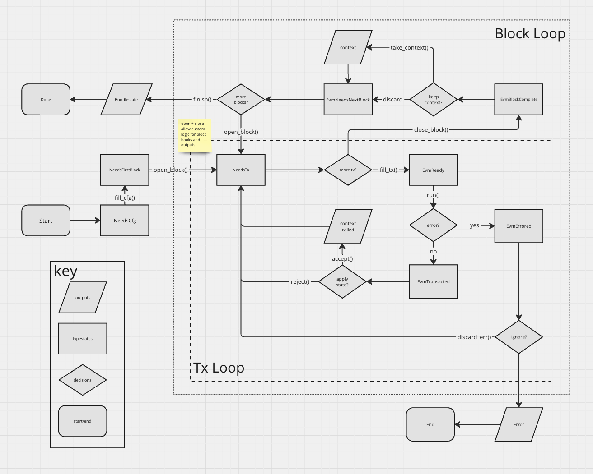

## Trevm

Trevm is a [typestate] API wrapper for [revm]. It provides an ergonomic way to
interact with the revm API, shortcuts for common tasks, and straightforward API
extensibility. Trevm does NOT try to provide low-level EVM management, but
rather to shortcut and simplify common tasks like simulating transactions.

Trevm is NOT a replacement for revm. It is a wrapper around the revm API. It is
NOT a drop-in upgrade, integrating trevm into your project will require changes
to your code.

See the [documentation on docs.rs] for information on usage.

## Why use Trevm?

Trevm is for building complex high-level flows on top of the low-level revm
API. It provides a state machine that ensures you can only take actions that are
valid in the current state. This makes it easier to reason about the state of
your EVM instance and ensures you don't make mistakes.

Trevm is useful for:

- full node implementations
- block builders
- searchers
- any other transaction simulation usecase

## Note on Trevm Versioning

Trevm generally uses [semantic versioning](https://semver.org/). While pre-1.0,
we also strive to indicate the MAJOR version of revm in the MINOR version of
trevm. For example, trevm `0.19.x` SHOULD BE compatible with revm `19.x.x`. In
general, we will try to maintain compatibility with the latest revm version,
and will not backport trevm fixes to older trevm or revm versions. It is
generally not advised to use old revm versions, as the EVM is a living spec.

In order to maintain this relationship (that trevm MINOR == revm MAJOR) we will
sometimes make breaking changes in patch versions. This is technically semver
compliant pre-1.0, but will cause build breakage downstream for users of those
features. We will take care to document breaking changes in patch releases
via github release notes.

## Limitations

Trevm is a work in progress and is not feature complete. In particular, trevm
does not currently have lifecycle support for blocks before Shanghai. This means
it cannot produce correct post-block states for blocks before Shanghai.

### The Trevm State Machine

Trevm provides a state machine that represents the internal state of a revm EVM
instance. It ensures that at each step you can only take actions that are valid
in the current state. This is done by using the [typestate] pattern.

As you progress between states, the API will change to reflect the available
operations. For example, you can't call `open_block()` on a `EvmNeedsTx` state,
as the block is already open. You can't call `close_block()` on a `EvmReady`
state, without explicitly clearing or running the transaction that has been
ready.

[typestate]: https://cliffle.com/blog/rust-typestate/
[revm]: https://github.com/bluealloy/revm
[docs.rs]: https://docs.rs/trevm/latest/trevm/
[documentation on docs.rs]: https://docs.rs/trevm/latest/trevm/
